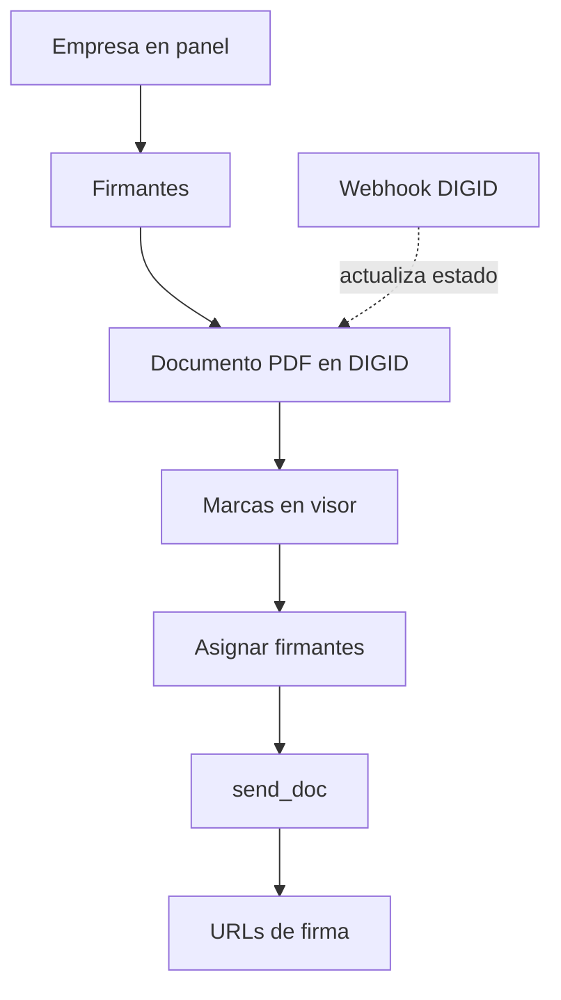

# Flujo de producto (Juxa Sign + DIGID)

Lectura rápida: quién hace qué, en qué orden, y qué datos viven en Prisma frente a DIGID.

## Actores

| Actor | Rol |
| ----- | --- |
| **Operador del panel** | Usuario de esta app Next.js: da de alta empresa y firmantes en DIGID vía el panel, sube PDF, coloca marcas, asigna, envía y obtiene URLs. |
| **Firmante DIGID** | Persona que firma en el flujo web/móvil de DIGID (fuera de este repositorio), usando los enlaces generados. |

## Orden de pantallas (happy path)

1. **Empresas** — Registro en DIGID (`RegistrarEmpresa`) → se guarda `digidIdClient` en PostgreSQL.
2. **Firmantes** — Alta vía Bearer (`save_signatory`) → IDs DIGID en Prisma por empresa.
3. **Documentos → Nuevo** — Subida (`create_doc`) → `digidDocumentId`, `urlDocumento`, estado.
4. **Documento (detalle)** — Visor PDF: marcas de firma guardadas en Prisma (`SignaturePlacement`). **Importante:** marcar con zoom 100 % (ver UI y [runbook-fallos.md](runbook-fallos.md)).
5. **Enviar** — Asignación (`add_assigned_doc`), luego envío (`send_doc`), luego APIs legacy para URLs de firma.
6. **Opcional** — Constancia (`certify_doc`) desde la misma pantalla de envío; webhook DIGID actualiza estado en segundo plano.

## Qué guarda Prisma vs qué vive solo en DIGID

| En Prisma | Solo / principalmente en DIGID |
| --------- | ------------------------------- |
| Empresa (metadatos + `digidIdClient`) | Validaciones y reglas de negocio del sandbox |
| Firmantes (mapeo a `digidSignatoryId`) | Sesión y experiencia de firma del firmante |
| Documento (nombre, IDs, `status` sincronizado) | PDF almacenado y procesamiento en DIGID |
| Marcas (coordenadas por página) | — |
| Certificados locales (si `certify_doc` devuelve PDF) | Eventos intermedios del flujo de firma |
| `WebhookEvent` (payload crudo, si se persiste) | — |

## Diagrama (resumen técnico)

Más detalle de endpoints en [map-acciones-api.md](map-acciones-api.md) y [api-digid.md](api-digid.md).
